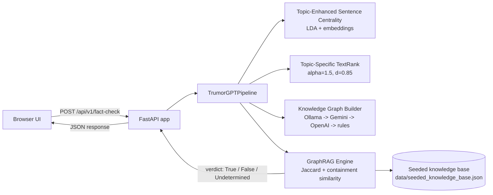

# TrumorGPT

> GraphRAG-powered health fact-checking engine — turns any health claim into a knowledge graph and verifies it against a seeded medical evidence base.

[](https://github.com/AkashNaickar/TrumorGPT/actions/workflows/ci.yml)
[](https://github.com/AkashNaickar/TrumorGPT/actions/workflows/gitleaks.yml)
[](LICENSE)
[](https://trumor-gpt.vercel.app)

**[Live demo →](https://trumor-gpt.vercel.app)** · [Fact-checking workspace](https://trumor-gpt.vercel.app/app) · [API docs](https://trumor-gpt.vercel.app/docs)

Implementation of *C. N. Hang, P.-D. Yu, and C. W. Tan, "TrumorGPT: Graph-Based Retrieval-Augmented Large Language Model for Fact-Checking," IEEE Transactions on Artificial Intelligence, vol. 6, no. 11, pp. 3148-3162, Nov. 2025* (DOI: 10.1109/TAI.2025.3567369).


## Features

- **End-to-end fact-checking pipeline** — sentence splitting, topic-enhanced centrality, Topic-Specific TextRank, knowledge-graph extraction, and GraphRAG verification in a single `POST /api/v1/fact-check` call.
- **Three-verdict output** — `True`, `False`, or `Undetermined`, with a similarity score, matched evidence graph, and a concise natural-language explanation.
- **Graceful LLM fallback chain** — triple extraction tries local Ollama (LLaMA 3.1 8B) → Google Gemini → OpenAI → a zero-dependency rule-based extractor, so the API works with no keys at all.
- **Optional LLM judge** — when GraphRAG abstains, a reachable LLM backend can decide (`metrics.verdict_source`), and the system safely stays `Undetermined` when no backend answers.
- **Deterministic embeddings** — hybrid LDA + sentence-embedding vectors with a fixed 384-dim TF-IDF fallback, so results are reproducible with or without `sentence-transformers` installed.
- **Dynamic knowledge base seeding** — `POST /api/v1/seed-graph` adds new verified graphs to the index at runtime.
- **Static web UI** — landing page and fact-checking workspace served directly by FastAPI.

## Tech stack

| Layer | Tech |
|-------|------|
| API | FastAPI, Pydantic v2, Uvicorn |
| NLP / ML | scikit-learn (LDA, TF-IDF), NumPy, joblib, sentence-transformers (optional) |
| LLM extraction | Ollama (LLaMA 3.1 8B), Gemini, OpenAI |
| Frontend | Static HTML/CSS/JS served by FastAPI |
| Hosting | Vercel Serverless Functions (Python) |

## Architecture



The pipeline implements hybrid sentence embeddings `v_s = [eta * e_hat_s ; (1-eta) * t_hat_s]` (eta = 0.7), topic-biased TextRank power iteration, and open-world graph verification via Jaccard/containment similarity with relational contradiction detection.

## Evaluation and results

The reproduction is evaluated honestly in two parts (all numbers in `results/metrics.json`,
predictions in `results/*_predictions.csv`, charts in `results/figures/`).

**Set C - GraphRAG component (KB-grounded, n=48).** Query graphs built directly from the
reference KB triples (positives) and their contradictions (negatives), isolating the
verification logic from the NL extractor.

| Metric | Value |
|--------|-------|
| Strict accuracy (Undetermined = wrong) | **91.7%** (44/48, 95% CI 83.3-97.9) |
| Accuracy on committed verdicts | **100%** (n=44) |
| Contradiction recall | **73.3%** (11/15) |

**Set A - end-to-end on real PolitiFact-derived claims (LIAR health-care, n=600, 300/300).**

| System | Strict acc. | Coverage | Determined acc. | Precision | Recall | F1 |
|--------|-------------|----------|-----------------|-----------|--------|----|
| Majority (all False) | 50.0% | 100% | 50.0% | 0.00 | 0.00 | 0.00 |
| TF-IDF + LogisticRegression | **58.8%** | 100% | 58.8% | 0.68 | 0.33 | 0.45 |
| TrumorGPT (this reproduction) | 0.0% | 0.2% | n/a (n=1) | - | - | - |
| Gemini zero-shot baseline | not run (quota) | - | - | - | - | - |
| TrumorGPT (**paper-reported**) | 88.5% | - | - | 91.4 | 85.0 | 88.1 |

**Honest reading of Set A.** The full reproduction *abstains* on 99.8% of real health claims:
it only commits when a claim graph overlaps the reference KB, and this environment ships just
**8 reference knowledge graphs**, whereas the paper used a large **DBpedia-derived health KB**
and **GPT-4** triple extraction. The 88.5% figure is **paper-reported, not reproduced here**.
See `results/error_analysis.md` for the failure breakdown.

**Ablations.** Contradiction detection is the biggest contributor (91.7% -> 68.8% when
removed); Jaccard-only similarity drops accuracy to 77.1%; the match threshold (0.1-0.6) is
insensitive on Set C; the eta/alpha sentence-ranking grid is flat on Set A because the
bottleneck there is KB coverage, not ranking.

**Data.** LIAR (Wang, 2017), 12,836 PolitiFact statements with 6-level ratings
(`github.com/thiagorainmaker77/liar_dataset`); filtered to `health-care` (1,434 rows), mapped to
binary as the paper does, balanced to 600 test claims (300/300, seed 42) with an 834-row
training pool. Provenance: `data/eval/PROVENANCE.md`. External statistics used in the
presentation are sourced in `docs/sources.md`.

## Quick start

> These commands were executed from a clean clone; the evaluation extra uses Python 3.12.

```bash
git clone https://github.com/AkashNaickar/TrumorGPT.git
cd TrumorGPT
python -m venv .venv
.venv\Scripts\pip install -r requirements.txt   # Linux/macOS: .venv/bin/pip
.venv\Scripts\pip install -r requirements-dev.txt  # evaluation + presentation extras
copy .env.example .env                          # optional keys, see table below

# run the API (src layout needs PYTHONPATH)
set PYTHONPATH=src                              # Linux/macOS: export PYTHONPATH=src
.venv\Scripts\python -m uvicorn trumorgpt.app:app --port 8000
```

Then open <http://127.0.0.1:8000> (landing page) or <http://127.0.0.1:8000/app> (workspace). Check `GET /health` for pipeline status.

To reproduce the full evaluation (downloads LIAR, builds the eval sets, evaluates, and makes
figures):

```powershell
pwsh -File scripts\reproduce.ps1
```

## Configuration

| Variable | Required | Description |
|----------|----------|-------------|
| `GEMINI_API_KEY` | no | Google Gemini key for hosted triple extraction. Falls back to `GOOGLE_API_KEY`. |
| `GOOGLE_API_KEY` | no | Alternative name accepted for the Gemini key. |
| `OPENAI_API_KEY` | no | OpenAI fallback for triple extraction. |
| `TRUMORGPT_OFFLINE` | no | Set to `1` to force the deterministic rule-based extractor (used by the evaluation harness). |

All keys are optional. Without any key, extraction tries local Ollama at `http://localhost:11434` (model `llama3.1:8b`) and then falls back to the built-in rule-based extractor.

## Testing

```bash
.venv\Scripts\python -m pytest tests -q
# or the standalone runner:
.venv\Scripts\python scripts\run_tests.py
```

Nine tests cover the LDA/embedding fusion shape, TextRank convergence, graph-builder triples,
GraphRAG similarity scoring, the full end-to-end pipeline, embedding-dimension stability,
metric computation, robustness edge cases (empty/long/non-English/no-KB claims), and LLM-judge
parsing. The suite is deterministic with or without `sentence-transformers` installed.

## Deployment

Deployed on **Vercel** as a Python Serverless Function (`api/index.py` → FastAPI app), configured via `vercel.json`. The live deployment is at <https://trumor-gpt.vercel.app>. Set `GEMINI_API_KEY` / `OPENAI_API_KEY` as Vercel environment variables (never in code) to enable hosted extraction.

## Roadmap

- [ ] Expand the seeded knowledge base beyond the current 8 graphs (e.g. ingest DBpedia health triples)
- [ ] Persist runtime-seeded graphs (currently in-memory per serverless instance)
- [ ] Replace the rule-based extractor with a lightweight local NER model
- [ ] Add response caching for repeated claims

## Contributing

Issues and PRs welcome. CI runs ruff, pytest, and gitleaks on every push and PR — please keep them green.

## License

MIT — see [LICENSE](LICENSE).
