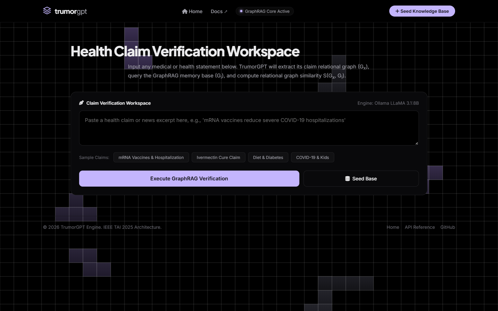

# TrumorGPT

> GraphRAG-powered health fact-checking engine — turns any health claim into a knowledge graph and verifies it against a seeded medical evidence base.

[](https://github.com/AkashNaickar/TrumorGPT/actions/workflows/ci.yml)
[](https://github.com/AkashNaickar/TrumorGPT/actions/workflows/gitleaks.yml)
[](LICENSE)
[](https://trumor-gpt.vercel.app)

**[Live demo →](https://trumor-gpt.vercel.app)** · [Fact-checking workspace](https://trumor-gpt.vercel.app/app) · [API docs](https://trumor-gpt.vercel.app/docs)



## Features

- **End-to-end fact-checking pipeline** — sentence splitting, topic-enhanced centrality, Topic-Specific TextRank, knowledge-graph extraction, and GraphRAG verification in a single `POST /api/v1/fact-check` call.
- **Three-verdict output** — `True`, `False`, or `Undetermined`, with a similarity score, matched evidence graph, and a concise natural-language explanation.
- **Graceful LLM fallback chain** — triple extraction tries local Ollama (LLaMA 3.1 8B) → Google Gemini 2.0 Flash → OpenAI GPT-4o-mini → a zero-dependency rule-based extractor, so the API works with no keys at all.
- **Deterministic embeddings** — hybrid LDA + sentence-embedding vectors with a fixed 384-dim TF-IDF fallback, so results are reproducible with or without `sentence-transformers` installed.
- **Dynamic knowledge base seeding** — `POST /api/v1/seed-graph` adds new verified graphs to the index at runtime.
- **Static web UI** — landing page and fact-checking workspace served directly by FastAPI.

## Tech stack

| Layer | Tech |
|-------|------|
| API | FastAPI, Pydantic v2, Uvicorn |
| NLP / ML | scikit-learn (LDA, TF-IDF), NumPy, joblib |
| LLM extraction | Ollama (LLaMA 3.1 8B), Gemini 2.0 Flash, OpenAI GPT-4o-mini |
| Frontend | Static HTML/CSS/JS served by FastAPI |
| Hosting | Vercel Serverless Functions (Python) |

## Architecture


The pipeline implements the architecture described in the project's IEEE TAI 2025 paper reference: hybrid sentence embeddings `v_s = [η·ê_s ; (1−η)·t̂_s]` (η = 0.7), topic-biased TextRank power iteration, and open-world graph verification via Jaccard/containment similarity with relational contradiction detection.

## Quick start

> These commands were executed from a clean clone on Python 3.14.

```bash
git clone https://github.com/AkashNaickar/TrumorGPT.git
cd TrumorGPT
python -m venv .venv
.venv\Scripts\pip install -r requirements.txt   # Linux/macOS: .venv/bin/pip
copy .env.example .env                          # optional keys, see table below

# run the API (src layout needs PYTHONPATH)
set PYTHONPATH=src                              # Linux/macOS: export PYTHONPATH=src
.venv\Scripts\python -m uvicorn trumorgpt.app:app --port 8000
```

Then open <http://127.0.0.1:8000> (landing page) or <http://127.0.0.1:8000/app> (workspace). Check `GET /health` for pipeline status.

## Configuration

| Variable | Required | Description |
|----------|----------|-------------|
| `GEMINI_API_KEY` | no | Google Gemini 2.0 Flash key for hosted triple extraction. Falls back to `GOOGLE_API_KEY`. |
| `GOOGLE_API_KEY` | no | Alternative name accepted for the Gemini key. |
| `OPENAI_API_KEY` | no | OpenAI GPT-4o-mini fallback for triple extraction. |

All keys are optional. Without any key, extraction tries local Ollama at `http://localhost:11434` (model `llama3.1:8b`) and then falls back to the built-in rule-based extractor.

## Testing

```bash
.venv\Scripts\python -m pytest tests -q
```

Five tests cover the LDA/embedding fusion shape, TextRank convergence, graph-builder triples, GraphRAG similarity scoring, and the full end-to-end pipeline. The suite is deterministic with or without `sentence-transformers` installed.

## Deployment

Deployed on **Vercel** as a Python Serverless Function (`api/index.py` → FastAPI app), configured via `vercel.json`. The live deployment is at <https://trumor-gpt.vercel.app>. Set `GEMINI_API_KEY` / `OPENAI_API_KEY` as Vercel environment variables (never in code) to enable hosted extraction.

## Roadmap

- [ ] Expand the seeded knowledge base beyond the current 8 graphs
- [ ] Persist runtime-seeded graphs (currently in-memory per serverless instance)
- [ ] Replace the rule-based extractor with a lightweight local NER model
- [ ] Add response caching for repeated claims

## Contributing

Issues and PRs welcome. CI runs ruff, pytest, and gitleaks on every push and PR — please keep them green.

## License

MIT — see [LICENSE](LICENSE).
